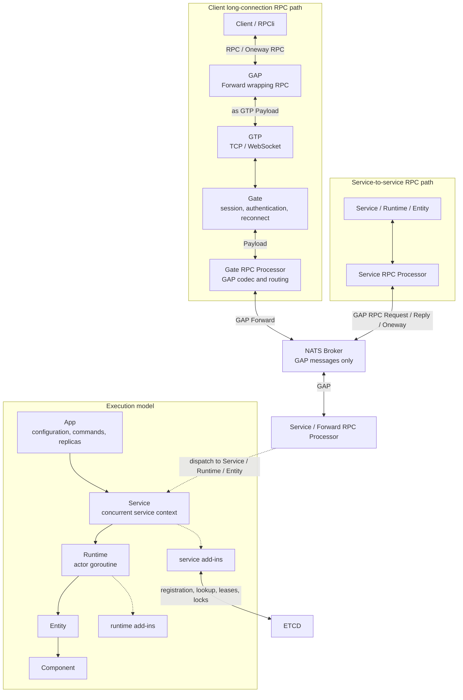
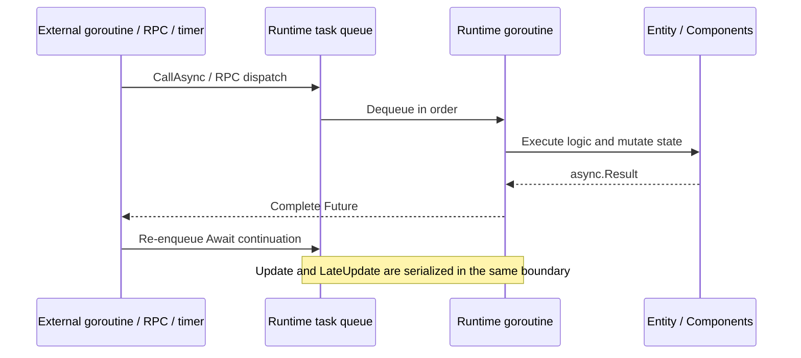

# Golaxy Framework

**English** | [简体中文](./README.zh_CN.md)

Golaxy Framework is a Go service framework for real-time, distributed backends. It uses the EC (Entity-Component) system and Actor-style serialized execution model from [Golaxy Core](https://github.com/pangdogs/core) as its kernel, then adds application bootstrap, service and runtime assembly, distributed infrastructure, RPC, gateways, and a network protocol stack.

The project is designed for game servers, long-lived connection gateways, stateful business services, remote-control platforms, and other real-time systems that need entity-oriented state management and cross-node communication.

## Contents

- [Positioning](#positioning)
- [Key capabilities](#key-capabilities)
- [Architecture](#architecture)
- [Actor + EC framework in depth](#actor--ec-framework-in-depth)
- [Requirements](#requirements)
- [Quick start](#quick-start)
- [Configuration](#configuration)
- [Programming model](#programming-model)
- [Add-in system](#add-in-system)
- [Distributed communication and protocols](#distributed-communication-and-protocols)
- [Project layout](#project-layout)
- [Observability and operational guidance](#observability-and-operational-guidance)
- [Development and verification](#development-and-verification)
- [Ecosystem and license](#ecosystem-and-license)

## Positioning

Golaxy Framework is the server-side extension layer of the Golaxy ecosystem. It focuses on the following concerns:

- Assemble, start, and stop multiple logical services and replicas in one process.
- Isolate stateful workloads in runtimes, each of which serializes tasks and entity state on its owning goroutine.
- Model composable, persistent, and globally addressable business objects with entities, components, and prototypes.
- Integrate logging, configuration, messaging, discovery, distributed locks, distributed entities, and RPC behind consistent APIs.
- Provide GAP and GTP protocols plus gateway features for service messaging and long-lived client connections.

This repository is a framework library; it does not bundle application services or infrastructure processes. The default assembly connects to NATS and ETCD. [Golaxy Scaffold](https://github.com/pangdogs/scaffold) is the companion game-project scaffold and build-time toolset. Its primary capabilities are Protobuf code generation for Go/Godot and Excel-table schema, code, and data processing; it does not implement friend, mail, or other product services. See [Golaxy Examples](https://github.com/pangdogs/examples) for end-to-end usage.

### Business and tooling boundaries

| Scope | Typical responsibility | Recommended integration |
| --- | --- | --- |
| Long-lived connection core services | Real-time player state, rooms, battles, and scenes | Client RPC travels through GAP → GTP → Gate, then GAP over NATS to the target service. |
| Independent HTTP business services | Common request/response features such as friends, mail, and operations administration | Expose HTTP APIs; call internal RPC or the appropriate data service when real-time state is required. |
| Golaxy Scaffold | Game-project layout and build tooling, not product-domain services | Generate Go/Godot protocol code with the Protobuf toolchain, and use `excelc` to turn `.xlsx` into `.proto`, access code, and JSON/binary table data. |

## Key capabilities

- **Application and service orchestration**: Cobra/Viper-based commands and configuration, multiple services and replicas, signal-driven graceful shutdown, and optional pprof.
- **Actor + EC execution model**: serialized runtime state, composable entities and components, optional real-time frame loops, and automatic dependency injection.
- **Asynchronous coordination**: runtime scheduling, background goroutines, timers, channels converted to futures, and `Any`, `OK`, `All`, `Transform`, and `Foreach` await strategies.
- **Distributed infrastructure**: a NATS broker, ETCD service discovery, ETCD/Redis distributed mutexes, service-node registration, and distributed-entity lookup.
- **RPC**: Service, Runtime, Entity, and Client targets with unicast, load balancing, broadcast, one-way calls, and future-based results.
- **Gateway and routing**: TCP/WebSocket sessions, authentication, reconnection, clock synchronization, entity-to-session mappings, logical groups, and multicast.
- **Database integrations**: GORM for MySQL, PostgreSQL, SQL Server, and SQLite, plus Redis and MongoDB add-ins and tag-based client injection.
- **Protocol stack**: GAP for application messages and dynamic arguments; GTP for connection handshakes, ordering, heartbeats, compression, and optional encryption.

## Architecture



### RPC transport paths

| Path | Actual protocol path | Description |
| --- | --- | --- |
| Client → Service | RPC → GAP `MsgForward` → GTP Payload → Gate → GAP `MsgForward` → NATS → `ForwardProcessor` | A client sends RPC as well. Gate decodes GAP, resolves the service node from the Session/Entity mapping, and forwards the call. |
| Service → Service | RPC → GAP `MsgRPCRequest` / `MsgOnewayRPC` → NATS → `ServiceProcessor` | Internal service communication uses GAP over NATS directly and never enters GTP. RPC Reply returns over the same path. |
| Service → Client | RPC → GAP `MsgForward` → NATS → Gate → GAP → GTP Payload → Client | Gate resolves a Session from a client unicast address or logical group and sends it over the GTP connection. Client `RPCli` decodes GAP and invokes a local script. |

For a client call, `RPCli` serializes `MsgRPCRequest`, `MsgOnewayRPC`, or `MsgRPCReply` into `MsgForward.TransData`. The outer `MsgForward` is GAP-encoded and sent as a GTP Payload. The Gate RPC Processor receives that Payload from the GTP session, decodes GAP, rebuilds the forwarding origin and destination, and passes it to `dsvc` for publication through NATS. Consequently, GTP ends at the client connection boundary; the service message bus uniformly carries GAP.

### Core objects

| Object | Responsibility |
| --- | --- |
| `App` | Registers service assemblers, loads configuration, starts the requested replicas, and waits for every service during shutdown. |
| `IService` | Extends `core/service.Context` with service add-ins, configuration, logging, private memory, and Runtime/Entity builders. |
| `IRuntime` | Extends `core/runtime.Context` with a task queue, entity manager, optional frame loop, and runtime add-ins. |
| Entity Prototype | Declares an entity type, default scope, component set, and metadata in the service entity library. |
| Entity | A stateful business object in a runtime. Global entities can be advertised automatically by the distributed-entity add-in. |
| Component | A unit of behavior composed into an entity. `ComponentBehavior` exposes the owning Runtime, Service, logger, async helpers, and RPC helpers. |
| Add-in | A replaceable Service or Runtime extension. Defaults are installed only when a capability with the same name is still absent. |
| Future / Await | Represents asynchronous results and schedules result handling back onto the caller's owning Runtime. |

### Execution and shutdown

- Every service registered with `SetAssembler` starts with one replica by default. Override this with `startup.services`; `IService.ReplicaNo()` returns a zero-based replica number.
- Each service replica runs in its own goroutine, and one service may own multiple runtimes.
- Ordinary runtime tasks and entity state are serialized on the owning Runtime goroutine. Do not access runtime state from other goroutines unless an API explicitly documents concurrent safety.
- `App` listens for `SIGHUP`, `SIGINT`, `SIGTERM`, and `SIGQUIT`. The first signal cancels the shared context, after which the application waits for all service replicas to terminate.

## Actor + EC framework in depth

### How Actor and EC work together

Golaxy combines two orthogonal models: Actor defines **who owns mutable state and where code executes**, while EC defines **how business objects are decomposed, composed, and evolved**.

| Model | Problem it solves | Golaxy concepts |
| --- | --- | --- |
| Actor | Isolates mutable state and prevents conflicting writes through serialized message processing. | `Runtime`, its task queue and owning goroutine, Future, and Await. |
| EC | Gives identity to stateful objects and composes capabilities from replaceable components. | Entity, Component, Prototype, lifecycle callbacks, and EntityTree. |

> The Actor boundary is the **Runtime, not an individual Entity**. A Runtime may manage one Entity or a group of entities that require strict execution ordering. EC here means Entity-Component; unlike a conventional data-oriented ECS, its primary programming model is not global System queries and batch processing. Behavior normally lives directly in Entity or Component lifecycle methods.

### Runtime is the state and execution boundary

Every Runtime owns a task queue, entity manager, entity tree, and optional frame loop. Application code should treat the owning Runtime goroutine as the sole ordinary writer of its Entity and Component state:



- Ordinary tasks, entity lifecycle transitions, and frame callbacks never run concurrently inside one Runtime, so business state within that Runtime normally needs no locks.
- An Entity does not automatically receive its own goroutine. Putting several entities in one Runtime makes them share one serialized execution domain.
- Code outside the Runtime may directly use only explicitly concurrent-safe contexts or read-only surfaces. Schedule state reads and writes through `CallAsync`, RPC, or another dispatch entry point.
- `GoAsync` is intended for blocking I/O and independent computation, but its function runs in a new goroutine and must not touch Runtime state directly. Use `Await` to schedule result handling back onto the Runtime.
- With the frame loop enabled, `Update()` and `LateUpdate()` share the execution boundary with ordinary tasks. A slow or blocking callback therefore delays both message handling and frame progress and should be moved off the Actor goroutine.
- Framework-created runtimes use an unbounded task queue by default. This avoids immediate capacity failures for producers, but the application must control backlog through rate limits, timeouts, and metrics.

Service is the concurrent outer scope around runtimes. It holds service add-ins, entity/component prototype libraries, and the global entity index. Even after a cross-runtime or cross-node lookup resolves an entity, the call must still be dispatched to its owning Runtime instead of mutating it concurrently through a side channel.

### Entity, Component, and Prototype

| Concept | Semantics |
| --- | --- |
| Entity | A business object with an ID (generated when no persistence ID is supplied), scope, and metadata. It is also a component container and lifecycle root. |
| Component | A unit of state or behavior attached to an Entity. Components can be added, enabled, and disabled dynamically; removable components can also be detached. Each has its own lifecycle. |
| Entity Prototype | A reusable service-level construction definition for the Entity implementation, default scope, metadata, component options, and built-in component set. |
| Component Prototype | A component construction definition registered by its full Go type name and available to prototype declarations and dependency injection. |
| EntityManager | The Runtime-local entity collection responsible for entry, removal, and lifecycle progression. |
| EntityTree | Parent-child relationships inside a Runtime, with attach, detach, move, and traversal operations. Changing a tree edge does not itself destroy an Entity. |

An Entity may contain several Components with the same name. `GetComponent` returns the first match, while `GetComponents` returns all matches. Components reuse the Entity ID by default; enable `SetComponentUniqueID(true)` to assign independent IDs and make `GetComponentById` available.

Entity, Component, and Runtime also expose in-process signal/slot-style events. An event is emitted synchronously on the sender's current goroutine; it neither enters the Runtime task queue nor provides cross-process delivery. Code on an external goroutine must therefore enter the Runtime before emitting a business event. Subscription handles stored in the object's `Managed()` collection are unbound automatically when their owner is destroyed or terminated.

Scope determines **where an Entity can be found**, not **where it executes**:

| Scope | Lookup range | Distributed behavior |
| --- | --- | --- |
| `ec.Scope_Local` | Only the owning Runtime's entity manager. | It does not enter the Service global index and is not advertised by the default distributed-entity add-in. |
| `ec.Scope_Global` | Both the Runtime-local index and the Service global entity index. | The default distributed-entity registry publishes its location to ETCD for discovery by other nodes. |

`Scope_Global` provides addressability; it does not make an Entity concurrency-safe. Remote calls and service-level lookups must ultimately re-enter the owning Runtime for execution.

### Lifecycle and frame updates

The Runtime owns Entity and Component state transitions. Except for the Component enable/disable branch, lifecycles progress from construction toward destruction. Application code should never force a state transition itself:

```text
Entity activation:    Born -> Entered -> Awakened -> Starting -> Alive
Entity deactivation:  Leaving -> Shutting -> Dead -> Destroyed

Component activation: Born -> Attached -> Awakened -> Enabling -> Starting -> Alive
Disable and re-enable: Enabling / Starting / Alive -> Idle; Idle -> Starting -> Alive
Component removal:    Detaching -> Shutting -> Disabling -> Dead -> Destroyed
```

| Object | Callback order and semantics |
| --- | --- |
| Entity | `Awake()` at most once → `Start()` at most once → per-frame `Update()` / `LateUpdate()` → `Shut()` → `Dispose()`. Paired shutdown callbacks run only when the corresponding earlier phase completed. |
| Component | `Awake()` at most once → `OnEnable()` → `Start()` at most once → per-frame `Update()` / `LateUpdate()` → `Shut()` → `OnDisable()` → `Dispose()`. `OnEnable()` / `OnDisable()` may repeat as enabled state changes. |

Initial activation follows this concrete order:

1. Framework resolves component dependencies when automatic injection is enabled;
2. Entity `Awake()`;
3. each Component `Awake()`;
4. enabled Components `OnEnable()`;
5. enabled Components `Start()`;
6. Entity `Start()`, after which the Entity becomes `Alive`.

During Entity deactivation, Entity `Shut()` runs first, followed by Component `Shut()` in reverse order. Components then receive `OnDisable()` and `Dispose()` in reverse order, and Entity `Dispose()` runs last. Lifecycle interfaces are optional; objects without a particular callback still progress normally through their states.

When `AddComponent` is called on an active Entity, the Runtime advances the new component through `Awake`, `OnEnable`, and `Start`. Removal invokes the paired shutdown path. Components added directly at runtime are removable by default, while built-in components declared by an Entity Prototype are not; opt in with `ComponentDescriptor.SetRemovable(true)` when a built-in component must be detachable. Dynamic component changes, `SetEnabled`, Entity `Destroy`, and EntityTree mutations must all run inside the owning Runtime.

### Prototype composition and component injection

Prototypes separate “what a business object contains” from instance creation. `BuildEntityPT(name)` declares a template in the Service `EntityLib`, and `BuildEntity(name)` constructs an instance from the current template. Redeclaring the same prototype name replaces the previous definition; it does not retroactively alter entities that already exist.

Automatic injection is enabled on runtimes by default. Before an Entity or a newly added component activates, Framework scans every Component on that Entity and injects matching sibling components into pointer or interface fields. Dependencies are therefore available from Component `Awake()` onward:

```go
type Movement struct {
	framework.ComponentBehavior
	Position *Position `ec:"position"`
}

func (m *Movement) Awake() {
	if m.Position == nil {
		panic("movement requires position")
	}
}
```

- The tag format is `ec:"component name,full component prototype"`; either part can be selected as needed. `ec:"position"` injects by component name.
- An untagged pointer-to-struct field attempts to infer the component name and full prototype name from its type.
- If the tag names a registered component prototype but no matching component is attached, injection may construct and add that component dynamically.
- A missing match leaves the field unchanged, normally `nil`; validate required dependencies explicitly in `Awake()`.
- Adding a component to an active Entity rescans every Component, allowing existing components to receive the newly available dependency.

Automatic injection targets Component fields. An Entity should obtain its components through the component-manager API while inside the Runtime. Disable reflection-based injection with `SetAutoInjection(false)` when explicit wiring is preferred or the activation path is especially performance-sensitive.

### Choosing Runtime granularity

| Organization | Good fit | Main trade-off |
| --- | --- | --- |
| One main Entity per Runtime | Independent stateful objects such as players, devices, or order workflows. Calling `IService.BuildEntity()` directly uses this pattern by default. | Strong isolation and parallelism, but more runtimes. The Runtime terminates automatically when its main Entity deactivates. |
| A group of entities in one Runtime | A room, battle, scene, or another group that needs strictly ordered updates. Use `SetRuntime(rt)` to join an existing Runtime. | Straightforward group consistency, but one slow task stalls the entire group. |
| An independent long-lived Runtime | An in-service scheduler, matchmaker, or resident state machine. Create it first with `BuildRuntime()`, then add entities as needed. | Its lifecycle is not coupled to one business Entity, so its termination condition must be managed explicitly. |

As a rule, place state that must change in one serialized transaction in the same Runtime, and split state that needs true parallelism across runtimes. Treat cross-Runtime coordination as asynchronous message exchange; do not rely on shared mutable objects or implicit transactions spanning runtimes.

## Requirements

| Component | Requirement | Purpose |
| --- | --- | --- |
| Go | `1.25.0+` | Matches the current `go.mod`. |
| NATS | Required by default | Default broker and service-to-service GAP/RPC transport. The default endpoint is `localhost:4222`. |
| ETCD | Required by default | Default discovery, distributed synchronization, and distributed-entity query/registration. The default endpoint is `localhost:2379`. |
| Redis | Optional | Redis-backed distributed synchronization and the Redis database add-in. |
| SQL database | Optional | MySQL, PostgreSQL, SQL Server, or SQLite through the GORM add-in. |
| MongoDB | Optional | MongoDB database add-in. |

> The default service assembly actively initializes the NATS and ETCD add-ins during startup, so these services must be reachable even for the minimal example. External dependencies may differ after replacing the defaults through installation hooks.

## Quick start

### 1. Create a module and install the framework

```bash
mkdir golaxy-demo
cd golaxy-demo
go mod init example.com/golaxy-demo
go get git.golaxy.org/framework@latest
```

### 2. Prepare the default infrastructure

Start reachable NATS and ETCD instances listening at:

- NATS: `localhost:4222`
- ETCD: `localhost:2379`

You can select different endpoints with startup flags or a configuration file.

### 3. Create a minimal service

```go
package main

import "git.golaxy.org/framework"

type LobbyService struct {
	framework.ServiceBehavior
}

func (*LobbyService) OnStarted(svc framework.IService) {
	rt, err := svc.BuildRuntime().
		SetName("main").
		SetEnableFrame(true).
		SetFPS(20).
		New()
	if err != nil {
		svc.S().Panicw("create runtime failed", "error", err)
	}

	svc.S().Infow("lobby service started", "runtime_id", rt.Id())
}

func main() {
	framework.NewApp().
		SetAssembler("lobby", &LobbyService{}).
		Run()
}
```

### 4. Run

```bash
go run .
```

Press `Ctrl+C` for graceful shutdown. The `lobby` name passed to `SetAssembler` is also:

- the service key in `startup.services`;
- the logical service name returned by `IService.Name()`;
- the configuration subtree returned by `IService.ServiceConf()`;
- the service name advertised by the distributed-service add-in.

When `SetAssembler` receives an instance or reflection type implementing `IService`, it creates a fresh instance of that concrete type for every replica; it does not reuse the supplied pointer.

## Configuration

### Sources and precedence

`App` binds Cobra flags to Viper. For the same key, values are resolved in this order:

1. A value set through `app.Conf().Set(...)`;
2. An explicitly supplied command-line flag;
3. An environment variable;
4. A local configuration file;
5. A remote configuration provider;
6. The built-in flag default.

Set `conf.local_path` to load a local file; its format is inferred from the extension. Remote configuration is read once at startup through a Viper remote provider. The current dependency supports `etcd`, `etcd3`, `consul`, `firestore`, and `nats`; the framework does not automatically watch for subsequent changes.

Environment variables follow Viper's default mapping: keys are uppercased, but dots are retained. With the prefix `GAME`, for example, `log.level` maps to `GAME_LOG.LEVEL`. To use the more conventional `GAME_LOG_LEVEL`, configure an `EnvKeyReplacer` on `app.Conf()` before `Run`. Because `conf.env_prefix` is resolved before local and remote configuration are loaded, set it through a command-line flag or `app.Conf().Set`.

### Built-in settings

| Setting | Default | Description |
| --- | --- | --- |
| `log.level` | `info` | `debug`, `info`, `warn`, `error`, `dpanic`, `panic`, or `fatal`. |
| `log.encoder` | `development` | Zap encoder: `development` or `production`. |
| `log.format` | `console` | Output format: `console` or `json`. |
| `log.async` | `true` | Enables the buffered log writer. |
| `log.buffer_size` | `524288` | Asynchronous log buffer size in bytes. |
| `log.flush_interval` | `1s` | Asynchronous log flush interval. |
| `conf.env_prefix` | empty | Environment-variable prefix. |
| `conf.local_path` | empty | Local configuration file; no file is read when empty. |
| `conf.remote_provider` | empty | Viper remote provider; no remote configuration is read when empty. |
| `conf.remote_endpoint` | empty | Remote configuration endpoint. |
| `conf.remote_path` | empty | Remote configuration key or file path. |
| `nats.address` | `localhost:4222` | Default NATS endpoint in `host:port` form. |
| `nats.username` | empty | NATS username. |
| `nats.password` | empty | NATS password. |
| `etcd.address` | `localhost:2379` | Default ETCD endpoint in `host:port` form. |
| `etcd.username` | empty | ETCD username. |
| `etcd.password` | empty | ETCD password. |
| `service.version` | `v0.0.0` | Node version advertised through discovery. |
| `service.meta` | empty map | Node metadata advertised through discovery. |
| `service.ttl` | `10s` | Service registration lease; must be at least 3 seconds. |
| `service.future_timeout` | `3s` | Default timeout for service interaction futures; must be at least 300 milliseconds. |
| `service.dent_ttl` | `10s` | Distributed-entity registration lease; must be at least 3 seconds. |
| `service.auto_recover` | `false` | Recovers panics during Service/Runtime execution and reports them to the logger. |
| `startup.services` | `1` for every registered service | Map of service name to replica count. Invalid or non-positive counts disable that service. |
| `pprof.enable` | `false` | Enables the Go pprof HTTP server. |
| `pprof.address` | `0.0.0.0:6060` | pprof listen address. |

The application-level `nats.address` and `etcd.address` settings are single-endpoint shortcuts. Use the corresponding add-in installation hook when you need multiple endpoints, TLS, or an existing client.

### Configuration file example

```yaml
log:
  level: info
  encoder: production
  format: json
  async: true

nats:
  address: localhost:4222

etcd:
  address: localhost:2379

service:
  version: v1.0.0
  meta:
    region: cn-east-1
    environment: production
  ttl: 10s
  future_timeout: 3s
  dent_ttl: 10s
  auto_recover: true

startup:
  services:
    lobby: "2"
    gate: "1"

pprof:
  enable: false
  address: 127.0.0.1:6060

lobby:
  tick_interval: 50ms
  matchmaking_region: cn-east-1
```

Inside the `lobby` service:

```go
appConf := svc.AppConf()         // the full merged configuration
serviceConf := svc.ServiceConf() // the lobby subtree; it may be nil when absent
```

Command-line override example:

```bash
./your-app \
  --startup.services lobby=2,gate=1 \
  --nats.address localhost:4222 \
  --etcd.address localhost:2379 \
  --conf.local_path ./config.yaml
```

If a configuration file explicitly defines `startup.services`, include every service that should run. Registered services omitted from that map are treated as having zero replicas.

## Programming model

### App and service replicas

- `NewApp()` creates an independent Cobra root command and Viper instance.
- `SetAssembler(name, assembler)` can register multiple logical services; registering the same name replaces the previous assembler.
- `InitCB` adds flags or Cobra subcommands; `StartingCB` runs after configuration and pprof initialization; `TerminateCB` runs after every service has stopped.
- `App.Cmd()` and `App.Conf()` expose extension points before `Run()`. Configuration and assembly methods should be called from the same goroutine.
- `IService.Memory()` is a replica-private concurrent key/value store, while `ReplicaNo()` returns the current replica number.

### Service lifecycle

| Phase | Intended work |
| --- | --- |
| `OnBirth` | The Service Context, configuration, and base logger exist. Install or replace service add-ins here. |
| Default assembly | The framework fills in logging, configuration, broker, discovery, distributed sync, distributed service, entity query, and RPC. |
| `OnBuilt` | Default add-ins are ready. This is the final application hook before the service add-in manager is frozen. |
| `OnStarting` | Service add-ins are frozen and active; they can no longer be installed or removed. |
| `OnStarted` | The distributed service has completed `BringUp`; subscriptions and node registration are ready for communication. |
| `OnHeartbeat` | Called approximately once per second while the service is running. |
| `OnTerminating` | Shutdown has started; notify application tasks to stop. |
| `OnTerminated` | Wait groups and add-ins have stopped. The framework then flushes logging and closes shared resources. |

Additional Service lifecycle interfaces cover entity prototypes, component prototypes, and global-entity registration and deregistration. See [`service_lifecycle.go`](./service_lifecycle.go) for the complete contracts.

### Runtime, Entity, and Component

This section covers the builder APIs; see [Actor + EC framework in depth](#actor--ec-framework-in-depth) for execution boundaries, state machines, and composition rules.

`BuildRuntime()` starts from these defaults:

| Option | Default |
| --- | --- |
| Automatic start | enabled |
| Task queue | unbounded |
| Frame loop | disabled |
| Target frame rate | `30` (used only when the frame loop is enabled) |
| Automatic component dependency injection | enabled |
| Panic recovery | inherited from the Service |
| Continue after entity-activation panic | disabled; the failed entity is removed |

Customize these values with `SetName`, `SetPersistId`, `SetMainEntity`, `SetEnableFrame`, `SetFPS`, `SetAutoInjection`, and `SetPanicHandling`. A runtime terminates automatically after its main entity is deactivated.

The following example declares a global `player` prototype and creates an entity:

```go
package main

import (
	"git.golaxy.org/core/ec"
	"git.golaxy.org/framework"
)

const playerPrototype = "player"

type GameService struct {
	framework.ServiceBehavior
}

type Player struct {
	framework.EntityBehavior
}

type Position struct {
	framework.ComponentBehavior
	X float64
	Y float64
}

type Movement struct {
	framework.ComponentBehavior
	Position  *Position `ec:"position"`
	VelocityX float64
	VelocityY float64
}

func (m *Movement) Awake() {
	if m.Position == nil {
		panic("movement requires position")
	}
	m.VelocityX = 0.25
}

func (m *Movement) Update() {
	m.Position.X += m.VelocityX
	m.Position.Y += m.VelocityY
}

func (*GameService) OnBuilt(svc framework.IService) {
	svc.BuildEntityPT(playerPrototype).
		SetInstance(&Player{}).
		SetScope(ec.Scope_Global).
		AddComponent(&Position{}, "position").
		AddComponent(&Movement{}, "movement").
		Declare()
}

func (*GameService) OnStarted(svc framework.IService) {
	_, err := svc.BuildEntity(playerPrototype).
		SetRuntimeCreator(
			svc.BuildRuntime().
				SetEnableFrame(true).
				SetFPS(20),
		).
		SetMeta(map[string]any{"region": "cn-east-1"}).
		New()
	if err != nil {
		svc.S().Panicw("create player failed", "error", err)
	}
}
```

- `BuildEntityPT(...).Declare()` registers the prototype in the current Service's entity library.
- When `IService.BuildEntity()` creates an entity without a selected Runtime, the framework creates a new Runtime and makes the entity its main entity.
- `Movement.Position` is injected before Component `Awake()`. The frame loop targets 20 FPS and calls `Update()` serially with the Runtime's other tasks.
- Use `EntityCreator.SetRuntime(rt)` to add an entity to an existing Runtime. Code already on the Runtime goroutine may also use `IRuntime.BuildEntity()`.
- Only `ec.Scope_Global` entities are advertised to ETCD by the default distributed-entity registry.
- Custom entities and components embed `EntityBehavior` and `ComponentBehavior` respectively to gain direct access to the owning Runtime, Service, logger, async helpers, and RPC helpers.

### Concurrency and async rules

| API | Execution location | Guidance |
| --- | --- | --- |
| `CallAsync` / `CallVoidAsync` | Owning Runtime goroutine | Read or modify Runtime, Entity, and Component state here. |
| `GoAsync` / `GoVoidAsync` | New goroutine | Use for blocking I/O or independent computation; do not access Runtime state directly. |
| `TimeAfterAsync` / `TimeAtAsync` / `TimeTickAsync` | Async timer producing Future results | Use for timers scoped to an entity or component lifetime. |
| `ReadChanAsync` | Converts channel values into a stream of Future results | Ends when the entity/component dies or the channel closes. |
| `Await(...).Any/OK/All` | Reschedules the result callback onto the Runtime | Waits for the first result, first successful result, or all results. |
| `Await(...).Transform/Foreach` | Handles each streaming result on the Runtime | Use with futures that produce multiple values. |

If the calling Entity or Component dies before an asynchronous operation returns, the related callback stops or returns `ErrAsyncCallerNotAlive`.

## Add-in system

### Default assembly

| Scope | Capability | Default implementation | Primary access point |
| --- | --- | --- | --- |
| Service | Logging | Zap logger | `svc.L()` / `svc.S()` |
| Service | Configuration | Viper config add-in | `svc.AppConf()` / `svc.ServiceConf()` |
| Service | Broker | NATS | `svc.Broker()` |
| Service | Discovery | ETCD | `svc.Registry()` |
| Service | Distributed synchronization | ETCD mutex | `svc.DistSync()` |
| Service | Distributed service | GAP + Broker + Discovery + DSync | `svc.DistService()` |
| Service | Distributed-entity query | ETCD + local Ristretto cache | `svc.DistEntityQuerier()` |
| Service | RPC | Built-in RPC facade and processor chain | `svc.RPC()` |
| Runtime | Logging | Reuses the Service logger | `rt.L()` / `rt.S()` |
| Runtime | RPC call stack | Built-in `rpcstack` | `rt.RPCStack()` |
| Runtime | Distributed-entity registration | ETCD lease | `rt.DistEntityRegistry()` |

### Replacing defaults

There are two ways to replace a default:

1. Install an add-in with the same name during `OnBirth`;
2. Implement the corresponding `InstallService...` or `InstallRuntime...` interface.

For every capability, the framework checks “already installed → instance installation hook → assembler installation hook → default implementation” and requires the capability to exist afterward. This example replaces the default ETCD-backed distributed mutex with Redis:

```go
import (
	"git.golaxy.org/framework"
	"git.golaxy.org/framework/addins"
)

func (*LobbyService) InstallDistSync(svc framework.IService) {
	addins.DsyncRedis.Install(svc,
		addins.DsyncRedisWith.RedisURL(
			svc.AppConf().GetString("redis.url"),
		),
	)
}
```

Service add-ins are frozen before `Starting`. Runtime add-ins may be installed or removed while running, but those operations should execute on the owning Runtime goroutine.

### Optional add-ins and tools

| Package | Capability |
| --- | --- |
| [`addins/gate`](./addins/gate) | TCP/WebSocket listeners, GTP handshakes, session authentication, reconnect migration, and data/event I/O. |
| [`addins/gate/cli`](./addins/gate/cli) | Low-level Gate client with connect, reconnect, clock probing, and Future management. |
| [`addins/router`](./addins/router) | Entity/Session mappings, ETCD-backed logical groups, unicast, and multicast. |
| [`addins/rpc/rpcpcsr`](./addins/rpc/rpcpcsr) | Service, Gate, and Forward RPC processors and deliverers. |
| [`addins/rpc/rpcli`](./addins/rpc/rpcli) | Client RPC built on the Gate client and GAP. |
| [`addins/db/sqldb`](./addins/db/sqldb) | GORM connections for MySQL, PostgreSQL, SQL Server, and SQLite. |
| [`addins/db/redisdb`](./addins/db/redisdb) | Tagged Redis clients. |
| [`addins/db/mongodb`](./addins/db/mongodb) | Tagged MongoDB clients. |
| [`addins/db`](./addins/db) | `InjectDB` injects clients by `db` struct tag; `MigrateDB` executes migration hooks in order. |

The root `addins` package re-exports built-in add-in descriptors and their `With` option entry points for convenient use in assembly code.

## Distributed communication and protocols

### Service addressing and RPC

`dsvc` creates five broker address classes for every service node:

- global broadcast;
- global load balancing;
- same-service broadcast;
- same-service load balancing;
- node unicast.

During bring-up, a node subscribes to its addresses before acquiring a distributed lock, checking for duplicates, and registering with discovery. This prevents an advertised node from losing messages before its subscriptions are ready. The current `dsvc` processing chain requires the broker to report `AtMostOnce` delivery semantics; a replacement broker must satisfy that constraint.

RPC builds on this addressing model and provides:

- Service, Runtime, Entity, and Client targets;
- named-service calls, random load balancing, and global load balancing;
- same-service and global one-way broadcasts;
- call-chain propagation and typed parse/assert helpers for up to 16 return values.

### GAP and GTP

| Layer | Responsibility |
| --- | --- |
| GAP (Golaxy Application Protocol) | Defines Forward, RPC Request/Reply, Oneway RPC, and other application messages. GAP can run over GTP or a Broker. |
| GAP Variant | Represents Null, integers, floating-point numbers, booleans, bytes, strings, Array, Map, Error, CallChain, and custom values on the wire. |
| GTP (Golaxy Transfer Protocol) | Runs over TCP/WebSocket and handles handshakes, authentication, message ordering, heartbeats, clock synchronization, reconnection, compression, and optional encryption. |
| GTP Codec / Transport | Implements the wire codec and the connection I/O, retries, event delivery, and protocol state machine. |

> **Protocol boundary:** GTP is used only for the TCP/WebSocket connection between Client and Gate. Client RPC is a GAP message carried in a GTP Payload. After Gate enters the service domain, and for every service-to-service RPC, NATS transports GAP only; GTP is never nested into the NATS path.

> **Security note:** GTP supports ECDHE, signing, and verification, but does not provide certificate validation itself. For high-security deployments, enable TLS below GTP on TCP/WebSocket and consider disabling GTP's built-in payload encryption; protocol signatures are not a replacement for a complete PKI trust chain. Do not expose pprof directly to untrusted networks either.

## Project layout

| Path | Responsibility |
| --- | --- |
| [`./`](./) | App, Service, Runtime, Entity/Component behaviors, builders, lifecycles, and async helpers. |
| [`addins`](./addins) | Aggregated exports for built-in add-in descriptors and option entry points. |
| [`addins/broker`](./addins/broker) | Broker abstraction, delivery semantics, and NATS implementation. |
| [`addins/conf`](./addins/conf) | Viper-backed application configuration and per-service subtrees. |
| [`addins/discovery`](./addins/discovery) | Service registration, lookup, watch APIs, and ETCD implementation. |
| [`addins/dsync`](./addins/dsync) | Distributed mutex abstraction with ETCD and Redis implementations. |
| [`addins/dsvc`](./addins/dsvc) | Service-node bring-up, address generation, GAP messaging, and Future control. |
| [`addins/dent`](./addins/dent) | Distributed-entity registration, query, events, and local caching. |
| [`addins/rpc`](./addins/rpc) | RPC facade, proxies, call paths, processors, clients, and result parsing. |
| [`addins/rpcstack`](./addins/rpcstack) | Runtime-scoped RPC call chain and variable stack. |
| [`addins/gate`](./addins/gate) | GTP gateway, listeners, handshakes, and session management. |
| [`addins/router`](./addins/router) | Session routing, entity mappings, logical groups, and multicast. |
| [`addins/db`](./addins/db) | SQL, Redis, and MongoDB add-ins plus injection and migration helpers. |
| [`net/gap`](./net/gap) | GAP messages, serialization, codec, and dynamic Variant values. |
| [`net/gtp`](./net/gtp) | GTP messages, codec, cryptographic/compression methods, and transport. |
| [`net/netpath`](./net/netpath) | Logical network paths for service addresses, topics, and related names. |
| [`utils/binaryutil`](./utils/binaryutil) | Byte streams, buffer pools, binary I/O, and bounded copying. |
| [`utils/concurrent`](./utils/concurrent) | FutureController, listener sets, and lightweight concurrency helpers. |

## Observability and operational guidance

- Logging uses Zap. Production deployments will typically choose `log.encoder=production` and `log.format=json`; the framework flushes buffered logging during shutdown.
- `service.auto_recover=false` is the default. When enabled, the Service and default Runtimes recover execution panics and report them through an error channel; the application must still decide whether continuing is safe for its consistency model.
- pprof is disabled by default. When enabled, bind `pprof.address` to loopback or a management network and add access control at the network boundary.
- Service and entity TTLs must be at least 3 seconds. Set production values according to ETCD latency, network jitter, and failure-detection goals rather than minimizing them blindly.
- Gate listen addresses, TLS, maximum packet size, compression threshold, authenticator, I/O timeouts, and session inbox capacities are independently configurable through `gate.With`.
- Replace the relevant default add-in when you need multiple NATS/ETCD endpoints, TLS, or custom client ownership. Clients supplied by the caller are not closed when an add-in shuts down.

## Development and verification

```bash
# Format
go fmt ./...

# Run all tests
go test ./...

# Check for data races on supported platforms
go test -race ./...

# Static analysis
go vet ./...
```

Protocol and low-level utility tests are concentrated in `net/gap/variant`, `net/gtp`, `net/gtp/codec`, `net/gtp/method`, `net/gtp/transport`, `utils/binaryutil`, and `utils/concurrent`.

## Ecosystem and license

- [Golaxy Core](https://github.com/pangdogs/core): EC system and Runtime/Service execution kernel.
- [Golaxy Scaffold](https://github.com/pangdogs/scaffold): game-project scaffold centered on Protobuf generation and Excel-table processing.
- [Golaxy Examples](https://github.com/pangdogs/examples): end-to-end service, gateway, and RPC examples.

This project is licensed under the [GNU Lesser General Public License v2.1](./LICENSE).
