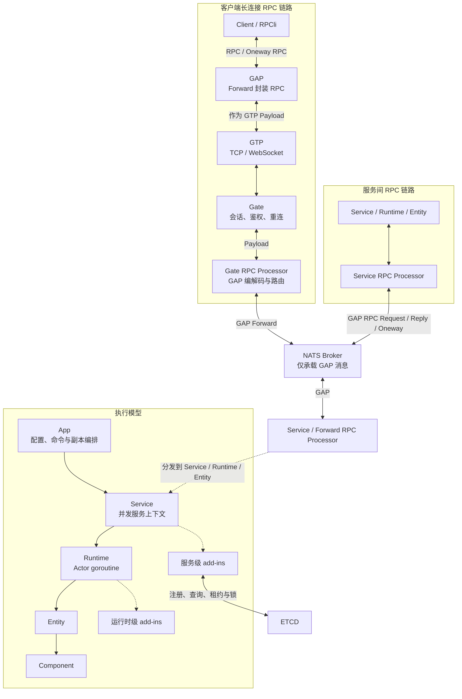
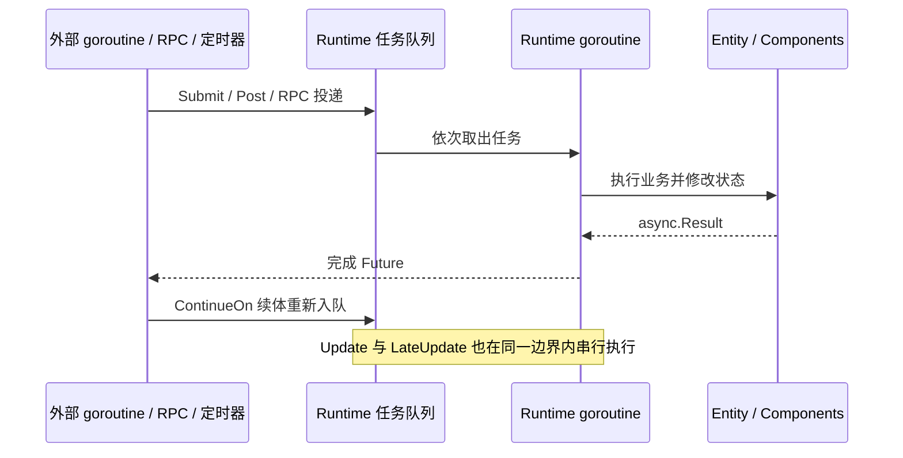

# Golaxy Framework

[English](./README.md) | **简体中文**

Golaxy Framework 是面向实时、分布式后端的 Go 服务开发框架。它以 [Golaxy Core](https://github.com/pangdogs/core) 的 EC（Entity-Component）系统和 Actor 风格串行执行模型为内核，在其上提供应用启动、服务与运行时装配、分布式基础设施、RPC、网关和网络协议栈。

项目适用于游戏服务端、长连接网关、状态型业务服务、远程控制平台，以及其他需要实体化状态管理和跨节点通信的实时系统。

## 目录

- [项目定位](#项目定位)
- [核心能力](#核心能力)
- [环境要求](#环境要求)
- [快速开始](#快速开始)
- [架构](#架构)
- [Actor + EC 框架详解](#actor--ec-框架详解)
- [配置](#配置)
- [编程模型](#编程模型)
- [Add-in 扩展体系](#add-in-扩展体系)
- [分布式通信与协议栈](#分布式通信与协议栈)
- [项目结构](#项目结构)
- [可观测性与运行建议](#可观测性与运行建议)
- [开发与验证](#开发与验证)
- [生态与许可证](#生态与许可证)

## 项目定位

Golaxy Framework 是 Golaxy 体系的服务端扩展层，主要解决以下问题：

- 将一个进程中的多个逻辑服务及其副本统一装配、启动和停止。
- 以 Runtime 隔离有状态业务，每个 Runtime 在所属 goroutine 中串行处理任务和实体状态。
- 通过 Entity、Component 和 Prototype 组织具有稳定身份、可组合、可分布式寻址的业务对象。
- 统一接入日志、配置、消息代理、服务发现、分布式锁、分布式实体和 RPC。
- 为服务间消息与客户端长连接提供配套的 GAP、GTP 协议和网关能力。

本仓库是框架库，不包含具体业务服务或基础设施进程。默认装配会连接 NATS 和 ETCD。[Golaxy Scaffold](https://github.com/pangdogs/scaffold) 是配套的游戏工程脚手架和构建期工具集，重点提供 Protobuf 的 Go/Godot 代码生成与 Excel 配表的 schema、代码和数据处理；它不包含好友、邮件等具体业务系统。端到端用法可参考 [Golaxy Examples](https://github.com/pangdogs/examples)。

### 业务与工具边界

| 范围 | 典型职责 | 推荐接入方式 |
| --- | --- | --- |
| 长连接核心业务 | 玩家在线状态、房间、战斗和场景等实时状态 | 客户端 RPC 经 GAP → GTP → Gate，再以 GAP over NATS 转发到目标服务。 |
| 独立 HTTP 业务服务 | 好友、邮件以及运营管理等常见请求/响应型功能 | 对外提供 HTTP API；需要访问实时状态时，再调用内部 RPC 或相应数据服务。 |
| Golaxy Scaffold | 游戏项目目录与构建工具，不承载产品业务 | 使用 Protobuf 工具链生成 Go/Godot 协议代码；使用 `excelc` 将 `.xlsx` 转换为 `.proto`、访问代码以及 JSON/二进制表数据。 |

## 核心能力

- **应用与服务编排**：基于 Cobra/Viper 的命令行和配置入口，支持多服务、多副本、信号驱动的优雅退出以及可选 pprof。
- **Actor + EC 执行模型**：Runtime 串行化状态访问，Entity/Component 负责业务组合，可按需启用实时帧循环和依赖自动注入。
- **异步协作**：提供 Runtime 调度、生命周期 Scope、后台 goroutine、定时器，以及语义分离的 Future、Signal、Stream、Future 组合器和 Runtime 续体。
- **分布式基础设施**：内置 NATS broker、ETCD 服务发现、ETCD/Redis 分布式互斥锁、服务节点注册和分布式实体定位。
- **RPC**：支持 Service、Runtime、Entity 和 Client 四类目标，覆盖单播、负载均衡、广播、单向调用和 Future 返回值。
- **网关与路由**：支持 TCP/WebSocket 会话、认证、重连、时钟同步、实体与会话映射、逻辑分组和组播。
- **数据库接入**：提供 GORM（MySQL、PostgreSQL、SQL Server、SQLite）、Redis 和 MongoDB add-in，以及按 tag 注入数据库客户端的辅助函数。
- **协议栈**：GAP 描述应用消息和动态参数；GTP 负责长连接握手、时序、心跳、压缩和可选加密。

## 环境要求

| 组件 | 要求 | 用途 |
| --- | --- | --- |
| Go | `1.25.0+` | 与当前 `go.mod` 保持一致。 |
| NATS | 默认需要 | 默认 broker，以及服务间 GAP/RPC 消息传输。默认地址为 `localhost:4222`。 |
| ETCD | 默认需要 | 默认服务发现、分布式同步、分布式实体查询与注册。默认地址为 `localhost:2379`。 |
| Redis | 可选 | Redis 版分布式同步和 Redis 数据库 add-in。 |
| SQL 数据库 | 可选 | MySQL、PostgreSQL、SQL Server 或 SQLite，由 GORM add-in 接入。 |
| MongoDB | 可选 | MongoDB 数据库 add-in。 |

> 默认服务装配会在启动期间主动初始化 NATS 和 ETCD 相关 add-in，因此最小示例运行前也需要这两个服务可用。通过安装钩子替换默认 add-in 后，外部依赖可以随实现调整。

## 快速开始

### 1. 创建模块并安装依赖

```bash
mkdir golaxy-demo
cd golaxy-demo
go mod init example.com/golaxy-demo
go get git.golaxy.org/framework@latest
```

### 2. 准备默认基础设施

启动可访问的 NATS 和 ETCD，并分别监听：

- NATS：`localhost:4222`
- ETCD：`localhost:2379`

也可以在启动参数或配置文件中使用其他地址。

### 3. 创建最小服务

```go
package main

import "git.golaxy.org/framework"

type LobbyService struct {
	framework.ServiceBehavior
}

func (*LobbyService) OnStarted(svc framework.IService) {
	rt, err := svc.BuildRuntime().
		SetName("main").
		SetEnableFrame(true).
		SetFPS(20).
		New()
	if err != nil {
		svc.S().Panicw("create runtime failed", "error", err)
	}

	svc.S().Infow("lobby service started", "runtime_id", rt.ID())
}

func main() {
	framework.NewApp().
		SetAssembler("lobby", &LobbyService{}).
		Run()
}
```

### 4. 运行

```bash
go run .
```

使用 `Ctrl+C` 触发优雅退出。传给 `SetAssembler` 的 `lobby` 同时是：

- `startup.services` 中的服务键名；
- `IService.Name()` 返回的逻辑服务名；
- `IService.ServiceConf()` 对应的配置子树名；
- 分布式服务 add-in 发布到服务发现系统的服务名。

`SetAssembler` 接收实现 `IService` 的实例或反射类型时，会按其具体类型为每个副本创建新实例，不会复用传入的指针。

## 架构



### RPC 通信链路

| 链路 | 实际协议路径 | 说明 |
| --- | --- | --- |
| Client → Service | RPC → GAP `MsgForward` → GTP Payload → Gate → GAP `MsgForward` → NATS → `ForwardProcessor` | 客户端通过长连接发起的同样是 RPC。Gate 负责解码 GAP、根据 Session/Entity 映射定位服务节点并转发。 |
| Service → Service | RPC → GAP `MsgRPCRequest` / `MsgOnewayRPC` → NATS → `ServiceProcessor` | 内部服务通信直接使用 GAP over NATS，不经过 GTP。RPC Reply 沿相同链路反向返回。 |
| Service → Client | RPC → GAP `MsgForward` → NATS → Gate → GAP → GTP Payload → Client | Gate 根据客户端单播地址或逻辑分组找到 Session，再通过 GTP 长连接下发；客户端 `RPCli` 解码 GAP 并调用本地脚本。 |

客户端调用时，`RPCli` 会把 `MsgRPCRequest`、`MsgOnewayRPC` 或 `MsgRPCReply` 序列化到 `MsgForward.TransData` 中；外层 `MsgForward` 经 GAP 编码后作为 GTP Payload 发送。Gate 的 RPC Processor 从 GTP 会话取得 Payload、解码 GAP 并重新构造转发来源和目标，然后交给 `dsvc` 通过 NATS 发布。由此，GTP 的职责止于客户端长连接传输，进入服务消息总线后的协议统一为 GAP。

### 核心对象

| 对象 | 职责 |
| --- | --- |
| `App` | 注册服务装配器，加载配置，按副本数启动服务，并在收到退出信号后等待全部服务停止。 |
| `IService` | 扩展 `core/service.Context`，提供服务级 add-in、配置、日志、私有内存和 Runtime/Entity 构建入口。 |
| `IRuntime` | 扩展 `core/runtime.Context`，承载任务队列、实体管理器、可选帧循环及运行时级 add-in。 |
| Entity Prototype | 在服务的实体原型库中声明实体类型、默认作用域、组件集合和元数据。 |
| Entity | 运行时中的有状态业务对象；全局作用域实体可由分布式实体 add-in 自动发布。 |
| Component | 组合到实体中的业务能力，可通过 `ComponentBehavior` 获取所属 Runtime、Service、日志和异步/RPC 辅助。 |
| Add-in | 安装到 Service 或 Runtime 上的可替换扩展；框架只在同名能力尚未安装时补装默认实现。 |
| Future / Signal / Stream | 分别表达一次性结果、无结果完成通知和连续结果；`ContinueOn` 将 Future 续体调度回所属 Runtime。 |

### 运行与关闭

- 每个通过 `SetAssembler` 注册的服务默认启动 1 个副本，可由 `startup.services` 覆盖；副本序号通过 `IService.ReplicaNo()` 获取，从 0 开始。
- 每个服务副本在独立 goroutine 中运行；同一服务可创建多个 Runtime。
- Runtime 中的普通任务和实体状态默认由所属 Runtime goroutine 串行处理。除明确标注并发安全的 API 外，不应从其他 goroutine 直接访问运行时状态。
- `App` 监听 `SIGHUP`、`SIGINT`、`SIGTERM` 和 `SIGQUIT`。收到信号后会取消共享上下文，并等待所有服务副本完成终止流程。

## Actor + EC 框架详解

### Actor 与 EC 如何协作

Golaxy 将两个相互正交的模型组合在一起：Actor 负责**状态由谁拥有、代码在哪里执行**，EC 负责**业务对象如何拆分、组合和演化**。

| 模型 | 解决的问题 | Golaxy 中的对应对象 |
| --- | --- | --- |
| Actor | 隔离可变状态，通过串行消息处理避免并发写冲突。 | `Runtime` 及其任务队列、所属 goroutine、Future 和续体。 |
| EC | 以身份稳定的实体承载状态，以可插拔组件组合能力。 | Entity、Component、Prototype、生命周期和 EntityTree。 |

> 这里的 Actor 边界是 **Runtime，而不是单个 Entity**。一个 Runtime 可以管理一个实体，也可以管理一组需要保持严格执行顺序的实体。文档中的 EC 指 Entity-Component；它不以传统数据导向 ECS 的全局 System 查询和批处理作为主要编程方式，业务行为通常直接实现在 Entity 或 Component 的生命周期方法中。

### Runtime 是状态与执行边界

每个 Runtime 拥有任务队列、实体管理器、实体树和可选帧循环。业务代码应把所属 Runtime goroutine 视为其中 Entity/Component 状态的唯一常规写入者：



- Runtime 内的普通任务、实体生命周期和帧回调不会彼此并行执行，因此同一 Runtime 内通常不需要为业务状态加锁。
- Entity 不会自动获得独立 goroutine。把多个 Entity 放入同一 Runtime，意味着它们共享一个串行执行域。
- Runtime 外部只能直接使用明确标注为并发安全的上下文或只读接口；状态读取和修改应通过 `Submit`、`Post`、RPC 或其他调度入口进入目标 Runtime。
- `Spawn` 适合阻塞 I/O 和独立计算，但其函数运行在新 goroutine 中，不能直接触碰 Runtime 状态；使用 `ContinueOn` 将 Future 的后续处理重新调度回 Runtime。
- 帧循环启用后，`Update()` 和 `LateUpdate()` 与普通任务共享执行边界。耗时或阻塞回调会同时拖慢消息处理和帧率，应移出 Actor goroutine。
- Framework 创建的 Runtime 默认使用无界任务队列。无界队列避免生产者因容量立即失败，但也意味着业务需要通过限流、超时和指标监控控制积压。

Service 是 Runtime 外层的并发作用域，保存服务级 add-in、实体/组件原型库和全局实体索引。跨 Runtime 或跨节点定位到实体后，调用仍要投递到该实体所属 Runtime，不能绕过 Actor 边界直接并发修改实体。

### Entity、Component 与 Prototype

| 概念 | 语义 |
| --- | --- |
| Entity | 具有 ID（未显式提供持久化 ID 时自动生成）、作用域和元数据的业务对象，同时也是组件容器与生命周期根节点。 |
| Component | 附着于 Entity 的行为或状态单元；可以动态添加、启用和禁用，可删除组件还可以动态移除，并拥有独立生命周期。 |
| Entity Prototype | 服务级可复用构造定义，声明实体实例类型、默认作用域、元数据、组件选项和内建组件集合。 |
| Component Prototype | 按完整 Go 类型名登记的组件构造定义，可供原型声明和依赖注入使用。 |
| EntityManager | Runtime 内的本地实体集合，负责实体进入、离开以及生命周期推进。 |
| EntityTree | Runtime 内的父子关系树，支持挂接、分离、移动和遍历；树关系变化本身不会销毁实体。 |

同一 Entity 允许存在多个同名 Component；`GetComponent` 返回第一个匹配项，`GetComponents` 返回全部匹配项。组件默认复用 Entity ID，启用 `SetComponentUniqueID(true)` 后才会分配独立 ID，并可使用 `GetComponentByID` 查询。

Entity、Component、Runtime 还暴露 signal/slot 风格的进程内事件。事件会在发送方当前 goroutine 中同步派发，不经过 Runtime 任务队列，也不承担跨进程通信；因此从外部 goroutine 触发业务事件前仍应先进入 Runtime。通过对象的 `Managed()` 保存订阅句柄，可在所属对象销毁或终止时自动解绑。

实体作用域决定“在哪里可以找到它”，不改变“在哪里执行它”：

| 作用域 | 查询范围 | 分布式行为 |
| --- | --- | --- |
| `ec.Scope_Local` | 仅所属 Runtime 的实体管理器。 | 不进入 Service 全局实体索引，也不会由默认分布式实体 add-in 发布。 |
| `ec.Scope_Global` | Runtime 本地索引和 Service 全局实体索引。 | 默认分布式实体注册 add-in 会把定位信息发布到 ETCD，供其他节点查询。 |

`Scope_Global` 只提供可寻址性，并不使 Entity 变成并发安全对象。远程调用或服务级查找最终仍需回到所属 Runtime 执行。

### 生命周期与帧更新

Runtime 负责推进 Entity 与 Component 状态；除 Component 的启用/禁用分支外，生命周期总体从构造走向销毁。业务代码不应自行跳转状态：

```text
Entity 激活:    Born -> Entered -> Awaking -> Starting -> Alive
Entity 停用:    Leaving -> Shutting -> Dead -> Destroyed

Component 激活: Born -> Attached -> Awaking -> Enabling -> Starting -> Alive
禁用与重启:     Enabling / Starting / Alive -> Idle；Idle -> Starting -> Alive
Component 移除: Detaching -> Shutting -> Disabling -> Dead -> Destroyed
```

| 对象 | 回调顺序与语义 |
| --- | --- |
| Entity | `Awake()` 最多一次 → `Start()` 最多一次 → 每帧 `Update()` / `LateUpdate()` → `Shut()` → `Dispose()`。只有完成对应前置阶段后，成对的关闭回调才会执行。 |
| Component | `Awake()` 最多一次 → `OnEnable()` → `Start()` 最多一次 → 每帧 `Update()` / `LateUpdate()` → `Shut()` → `OnDisable()` → `Dispose()`。`OnEnable()` / `OnDisable()` 可随启用状态反复调用。 |

初次激活的实际顺序是：

1. Framework 在开启自动注入时解析组件依赖；
2. Entity `Awake()`；
3. 各 Component `Awake()`；
4. 已启用的 Component `OnEnable()`；
5. 已启用的 Component `Start()`；
6. Entity `Start()`，随后进入 `Alive`。

实体停用时先调用 Entity `Shut()`，再按组件逆序执行 `Shut()`；之后按逆序完成组件的 `OnDisable()`、`Dispose()`，最后调用 Entity `Dispose()`。实现生命周期接口是可选的，没有对应方法的对象仍会正常推进状态。

对活动实体调用 `AddComponent` 时，Runtime 会让新增组件经过 `Awake`、`OnEnable` 和 `Start`；移除组件会触发配对的关闭流程。运行期直接添加的组件默认可删除，Entity Prototype 中声明的内建组件默认不可删除；如需移除内建组件，应使用 `ComponentDescriptor.SetRemovable(true)` 明确开启。组件的动态变更、`SetEnabled`、Entity `Destroy` 和 EntityTree 修改都应在所属 Runtime 中执行。

### 原型组合与组件依赖注入

原型把“一个业务对象由什么组成”从实例创建逻辑中抽离出来。`BuildEntityPT(name)` 在 Service 的 `EntityLib` 中声明模板，`BuildEntity(name)` 再根据当前模板创建实例；同名原型再次声明时会替换旧定义，已经创建的实体不会被追溯修改。

Runtime 默认开启自动注入。实体或新增组件激活前，Framework 会扫描该实体上的所有 Component，将同一 Entity 中匹配的组件注入目标组件的指针或接口字段，因此依赖在 Component `Awake()` 中已经可用：

```go
type Movement struct {
	framework.ComponentBehavior
	Position *Position `ec:"position"`
}

func (m *Movement) Awake() {
	if m.Position == nil {
		panic("movement requires position")
	}
}
```

- 标签格式为 `ec:"组件名,完整组件原型名"`，两部分可按需要指定；`ec:"position"` 表示按组件名注入。
- 未写标签的结构体指针字段会尝试按字段类型推导组件名和完整原型名。
- 指定了已登记的组件原型但实体中尚无匹配组件时，注入过程可以动态构造并添加它。
- 找不到匹配项时字段保持原值，通常为 `nil`；必需依赖应在 `Awake()` 中显式校验。
- 活动实体增加组件时，Framework 会重新扫描其全部 Component，使既有组件也能获得新依赖。

自动注入的目标是 Component 字段；Entity 如需组件，应在 Runtime 内通过组件管理 API 获取。可通过 `SetAutoInjection(false)` 关闭反射注入，在性能敏感或希望显式装配的场景中自行建立依赖。

### 如何选择 Runtime 粒度

| 组织方式 | 适合场景 | 主要权衡 |
| --- | --- | --- |
| 一个主 Entity 对应一个 Runtime | 玩家、设备、订单流程等彼此独立的状态对象。直接使用 `IService.BuildEntity()` 即为这种默认方式。 | 隔离性和并行度高；Runtime 数量也更多。主 Entity 停用时 Runtime 自动终止。 |
| 一组 Entity 共享一个 Runtime | 房间、战斗、场景或需要按严格顺序更新的一组对象。使用 `SetRuntime(rt)` 加入既有 Runtime。 | 组内一致性直观；任何慢任务都会阻塞整组对象。 |
| 独立的长期 Runtime | 服务内调度器、匹配器或常驻状态机。先通过 `BuildRuntime()` 创建，再按需加入实体。 | 生命周期不依赖单个业务实体，但需要明确管理终止条件。 |

通常应把必须在同一个串行事务中修改的状态放入同一 Runtime，把需要真正并行执行的状态拆到不同 Runtime。跨 Runtime 协作应视为异步消息交互，不要依赖共享可变对象或跨 Runtime 的隐式事务。

## 配置

### 配置来源与优先级

`App` 将 Cobra flags 绑定到 Viper，并按以下优先级读取同一个键：

1. 通过 `app.Conf().Set(...)` 设置的值；
2. 命令行中显式传入的 flag；
3. 环境变量；
4. 本地配置文件；
5. 远程配置源；
6. 内置 flag 默认值。

本地配置通过 `conf.local_path` 读取，格式由文件扩展名决定。远程配置通过 Viper remote provider 在启动时读取一次；当前依赖支持 `etcd`、`etcd3`、`consul`、`firestore` 和 `nats`，框架不会自动监听远程配置变化。

环境变量使用 Viper 默认规则：键名转为大写，但保留点号。例如设置前缀 `GAME` 后，`log.level` 对应 `GAME_LOG.LEVEL`。如需常见的 `GAME_LOG_LEVEL` 形式，可在 `Run` 前对 `app.Conf()` 设置 `EnvKeyReplacer`。`conf.env_prefix` 在本地和远程配置读取前确定，应通过命令行或 `app.Conf().Set` 设置。

### 内置配置项

| 配置项 | 默认值 | 说明 |
| --- | --- | --- |
| `log.level` | `info` | `debug`、`info`、`warn`、`error`、`dpanic`、`panic` 或 `fatal`。 |
| `log.encoder` | `development` | Zap 编码器：`development` 或 `production`。 |
| `log.format` | `console` | 输出格式：`console` 或 `json`。 |
| `log.async` | `true` | 是否使用缓冲日志写入器。 |
| `log.buffer_size` | `524288` | 异步日志缓冲区大小，单位为字节。 |
| `log.flush_interval` | `1s` | 异步日志刷新周期。 |
| `conf.env_prefix` | 空 | 环境变量前缀。 |
| `conf.local_path` | 空 | 本地配置文件路径；为空时不读取。 |
| `conf.remote_provider` | 空 | Viper 远程配置 provider；为空时不读取。 |
| `conf.remote_endpoint` | 空 | 远程配置端点。 |
| `conf.remote_path` | 空 | 远程配置键或文件路径。 |
| `nats.address` | `localhost:4222` | 默认 NATS 端点，格式为 `host:port`。 |
| `nats.username` | 空 | NATS 用户名。 |
| `nats.password` | 空 | NATS 密码。 |
| `etcd.address` | `localhost:2379` | 默认 ETCD 端点，格式为 `host:port`。 |
| `etcd.username` | 空 | ETCD 用户名。 |
| `etcd.password` | 空 | ETCD 密码。 |
| `service.version` | `v0.0.0` | 发布到服务发现系统的节点版本。 |
| `service.meta` | 空 map | 发布到服务发现系统的节点元数据。 |
| `service.ttl` | `10s` | 服务节点注册租约；必须不少于 3 秒。 |
| `service.future_timeout` | `3s` | 服务交互 Future 默认超时；必须不少于 300 毫秒。 |
| `service.dent_ttl` | `10s` | 分布式实体注册租约；必须不少于 3 秒。 |
| `service.auto_recover` | `false` | 是否恢复 Service/Runtime 执行中的 panic 并上报日志。 |
| `startup.services` | 每个已注册服务为 `1` | 服务名到副本数的映射；数量小于等于 0 或无效时不启动该服务。 |
| `pprof.enable` | `false` | 是否启动 Go pprof HTTP 服务。 |
| `pprof.address` | `0.0.0.0:6060` | pprof 监听地址。 |

应用级 `nats.address` 和 `etcd.address` 是单端点快捷配置。若需要多端点、TLS 或复用既有客户端，应通过对应的 add-in 安装钩子传入完整选项。

### 配置文件示例

```yaml
log:
  level: info
  encoder: production
  format: json
  async: true

nats:
  address: localhost:4222

etcd:
  address: localhost:2379

service:
  version: v1.0.0
  meta:
    region: cn-east-1
    environment: production
  ttl: 10s
  future_timeout: 3s
  dent_ttl: 10s
  auto_recover: true

startup:
  services:
    lobby: "2"
    gate: "1"

pprof:
  enable: false
  address: 127.0.0.1:6060

lobby:
  tick_interval: 50ms
  matchmaking_region: cn-east-1
```

在 `lobby` 服务中：

```go
appConf := svc.AppConf()         // 完整的合并配置
serviceConf := svc.ServiceConf() // lobby 子树；子树不存在时可能为 nil
```

命令行覆盖示例：

```bash
./your-app \
  --startup.services lobby=2,gate=1 \
  --nats.address localhost:4222 \
  --etcd.address localhost:2379 \
  --conf.local_path ./config.yaml
```

如果配置文件显式提供了 `startup.services`，请列出所有希望启动的服务；未列出的已注册服务会按 0 个副本处理。

## 编程模型

### App 与服务副本

- `NewApp()` 创建独立的 Cobra 根命令和 Viper 实例。
- `SetAssembler(name, assembler)` 可注册多个逻辑服务；同名注册会替换之前的装配器。
- `InitCB` 用于补充 flags 或 Cobra 子命令；`StartingCB` 在配置和 pprof 初始化后执行；`TerminateCB` 在全部服务停止后执行。
- `App.Cmd()` 和 `App.Conf()` 可在 `Run()` 前扩展命令和配置。配置及装配方法应由同一 goroutine 调用。
- `IService.Memory()` 提供副本私有的并发键值存储，`ReplicaNo()` 返回当前副本序号。

### Service 生命周期

| 阶段 | 可执行的工作 |
| --- | --- |
| `OnBirth` | Service Context、配置和基础日志器已创建；可提前安装或替换服务级 add-in。 |
| 默认装配 | 框架依次补齐日志、配置、broker、服务发现、分布式同步、分布式服务、实体查询和 RPC。 |
| `OnBuilt` | 默认 add-in 已齐备；这是服务 add-in 管理器冻结前的最后一个业务钩子。 |
| `OnStarting` | 服务 add-in 已冻结并激活，不再允许安装或卸载。 |
| `OnStarted` | 分布式服务已经 `BringUp`，节点完成订阅和注册，可以开始对外通信。 |
| `OnHeartbeat` | 服务运行期间约每秒调用一次。 |
| `OnTerminating` | 开始停止，可通知业务任务退出。 |
| `OnTerminated` | 等待组和 add-in 已停止；框架随后刷新日志并关闭共享资源。 |

还可实现实体原型、组件原型、全局实体注册和注销相关的 Service 生命周期接口。完整接口定义见 [`service_lifecycle.go`](./service_lifecycle.go)。

### Runtime、Entity 与 Component

本节介绍构建 API；执行边界、状态机和组合规则见前文 [Actor + EC 框架详解](#actor--ec-框架详解)。

`BuildRuntime()` 创建的 Runtime 默认配置如下：

| 选项 | 默认值 |
| --- | --- |
| 自动启动 | 开启 |
| 任务队列 | 无界队列 |
| 帧循环 | 关闭 |
| 目标帧率 | `30`（仅启用帧循环后生效） |
| 自动组件依赖注入 | 开启 |
| panic 恢复 | 继承 Service 配置 |
| 实体激活 panic 后继续 | 关闭，激活失败的实体会被移除 |

可通过 `SetName`、`SetPersistID`、`SetMainEntity`、`SetEnableFrame`、`SetFPS`、`SetAutoInjection` 和 `SetPanicHandling` 调整。主实体停用后，所属 Runtime 会自动终止。

下面的示例声明一个全局 `player` 原型，并创建实体：

```go
package main

import (
	"git.golaxy.org/core/ec"
	"git.golaxy.org/framework"
)

const playerPrototype = "player"

type GameService struct {
	framework.ServiceBehavior
}

type Player struct {
	framework.EntityBehavior
}

type Position struct {
	framework.ComponentBehavior
	X float64
	Y float64
}

type Movement struct {
	framework.ComponentBehavior
	Position  *Position `ec:"position"`
	VelocityX float64
	VelocityY float64
}

func (m *Movement) Awake() {
	if m.Position == nil {
		panic("movement requires position")
	}
	m.VelocityX = 0.25
}

func (m *Movement) Update() {
	m.Position.X += m.VelocityX
	m.Position.Y += m.VelocityY
}

func (*GameService) OnBuilt(svc framework.IService) {
	svc.BuildEntityPT(playerPrototype).
		SetInstance(&Player{}).
		SetScope(ec.Scope_Global).
		AddComponent(&Position{}, "position").
		AddComponent(&Movement{}, "movement").
		Declare()
}

func (*GameService) OnStarted(svc framework.IService) {
	_, err := svc.BuildEntity(playerPrototype).
		SetRuntimeCreator(
			svc.BuildRuntime().
				SetEnableFrame(true).
				SetFPS(20),
		).
		SetMeta(map[string]any{"region": "cn-east-1"}).
		New()
	if err != nil {
		svc.S().Panicw("create player failed", "error", err)
	}
}
```

- `BuildEntityPT(...).Declare()` 将原型注册到当前 Service 的实体库。
- 从 `IService.BuildEntity()` 创建实体且未指定 Runtime 时，框架会创建一个新 Runtime，并把该实体设为主实体。
- `Movement.Position` 在组件 `Awake()` 前自动注入；帧循环以 20 FPS 为目标调用 `Update()`，并与 Runtime 中的其他任务串行执行。
- 使用 `EntityCreator.SetRuntime(rt)` 可将实体加入已有 Runtime；在 Runtime goroutine 内也可使用 `IRuntime.BuildEntity()`。
- 只有 `ec.Scope_Global` 实体会由默认分布式实体注册 add-in 发布到 ETCD。
- 自定义 Entity 和 Component 分别匿名嵌入 `EntityBehavior` 与 `ComponentBehavior` 后，可直接访问所属 Runtime、Service、日志、异步和 RPC 辅助 API。

### 并发与异步约束

| API | 执行位置 | 使用建议 |
| --- | --- | --- |
| `Submit` / `SubmitVoid` | 所属 Runtime goroutine | 提交需要结果的任务，用于读取或修改 Runtime、Entity、Component 状态。 |
| `Post` | 所属 Runtime goroutine | 投递无需结果的任务；不创建 Future。 |
| `Spawn` / `SpawnVoid` | Scope 管理的新 goroutine | 用于阻塞 I/O 或独立计算；不要直接并发访问 Runtime 状态。 |
| `After` / `At` | 异步计时并完成一次 Future | 用于实体或组件生命周期内的一次性定时任务。 |
| `Every` / `FromChan` | 产出单消费 Stream | 用于周期计时或通道桥接；Scope 取消或来源关闭时结束。 |
| `ContinueOn` / `ContinueOnVoid` | 续体重新调度到所属 Runtime | 在 Future 完成后安全地继续访问 Runtime 局部状态。 |
| `async.Race` / `FirstSuccess` / `All` / `AllSettled` | 组合一次性 Future | 分别选择首个完成、首个成功，或收集全部结果。 |

`Future` 保存一个可重放结果，`Signal` 只表示生命周期操作已经完成，`Stream` 表示连续结果且由单个消费者读取。Entity 和 Component 的异步辅助绑定各自的 `AsyncScope()`；对象失活后，相关后台任务和流会收到取消，尚未执行的任务或续体会停止或返回 `ErrAsyncCallerNotAlive`。

## Add-in 扩展体系

### 默认装配

| 作用域 | 能力 | 默认实现 | 主要访问入口 |
| --- | --- | --- | --- |
| Service | 日志 | Zap logger | `svc.L()` / `svc.S()` |
| Service | 配置 | Viper config add-in | `svc.AppConf()` / `svc.ServiceConf()` |
| Service | Broker | NATS | `svc.Broker()` |
| Service | 服务发现 | ETCD | `svc.Registry()` |
| Service | 分布式同步 | ETCD mutex | `svc.DistSync()` |
| Service | 分布式服务 | GAP + Broker + Discovery + DSync | `svc.DistService()` |
| Service | 分布式实体查询 | ETCD + 本地 Ristretto 缓存 | `svc.DistEntityQuerier()` |
| Service | RPC | 内置 RPC 门面和处理链 | `svc.RPC()` |
| Runtime | 日志 | 复用 Service logger | `rt.L()` / `rt.S()` |
| Runtime | RPC 调用栈 | 内置 `rpcstack` | `rt.RPCStack()` |
| Runtime | 分布式实体注册 | ETCD lease | `rt.DistEntityRegistry()` |

### 替换默认实现

有两种替换方式：

1. 在 `OnBirth` 中直接安装同名 add-in；
2. 实现对应的 `InstallService...` 或 `InstallRuntime...` 接口。

框架会依次检查“是否已经安装 → 实例安装钩子 → 装配器安装钩子 → 默认实现”，并要求最终存在对应能力。以下示例把默认 ETCD 分布式锁替换为 Redis：

```go
import (
	"git.golaxy.org/framework"
	"git.golaxy.org/framework/addins"
)

func (*LobbyService) InstallDistSync(svc framework.IService) {
	addins.DsyncRedis.Install(svc,
		addins.DsyncRedisWith.RedisURL(
			svc.AppConf().GetString("redis.url"),
		),
	)
}
```

服务级 add-in 可在 `OnBirth`、安装钩子或 `OnBuilt` 中安装，并在 `Starting` 回调前冻结。`OnBuilt` 发生在默认装配之后，适合追加自定义 add-in；替换默认实现应使用 `OnBirth` 或对应安装钩子。Runtime 级 add-in 支持运行期安装和卸载，但应在所属 Runtime goroutine 中操作。

### 可选 add-in 与工具

| 包 | 能力 |
| --- | --- |
| [`addins/gate`](./addins/gate) | TCP/WebSocket 监听、GTP 握手、会话认证、重连迁移、数据与事件 I/O。 |
| [`addins/gate/cli`](./addins/gate/cli) | 面向 Gate 的底层客户端，支持连接、重连、时钟探测和请求响应关联。 |
| [`addins/router`](./addins/router) | Entity/Session 映射、ETCD 持久化逻辑分组、单播和组播。 |
| [`addins/rpc/rpcpcsr`](./addins/rpc/rpcpcsr) | Service、Gate 和 Forward RPC 处理器及投递器。 |
| [`addins/rpc/rpcli`](./addins/rpc/rpcli) | 构建在 Gate Client 和 GAP 上的客户端 RPC。 |
| [`addins/db/sqldb`](./addins/db/sqldb) | 基于 GORM 的 MySQL、PostgreSQL、SQL Server 和 SQLite 连接。 |
| [`addins/db/redisdb`](./addins/db/redisdb) | 具名 Redis 客户端。 |
| [`addins/db/mongodb`](./addins/db/mongodb) | 具名 MongoDB 客户端。 |
| [`addins/db`](./addins/db) | `InjectDB` 按 `db` struct tag 注入数据库客户端，`MigrateDB` 串行执行迁移钩子。 |

`addins` 根包集中重新导出了内置 add-in 描述符和 `With` 选项入口，适合在装配代码中统一导入。

## 分布式通信与协议栈

### 服务寻址与 RPC

`dsvc` 为每个服务节点建立五类 broker 地址：

- 全局广播；
- 全局负载均衡；
- 同名服务广播；
- 同名服务负载均衡；
- 节点单播。

节点上线时会先订阅地址，再通过分布式锁查重并注册到服务发现系统，从而避免已发布节点在订阅就绪前丢失消息。当前 `dsvc` 处理链要求 broker 报告 `AtMostOnce` 投递语义；替换 broker 时必须满足这一约束。

RPC 在此寻址模型上提供：

- Service、Runtime、Entity 和 Client 目标；
- 指定服务调用、随机负载均衡、全局负载均衡；
- 指定服务广播和全局广播的单向调用；
- 调用链透传，以及最多 16 个返回值的类型化解析/断言辅助。

### GAP 与 GTP

| 层 | 职责 |
| --- | --- |
| GAP（Golaxy Application Protocol） | 定义 Forward、RPC Request/Reply、Oneway RPC 等应用消息；可运行在 GTP 或 Broker 之上。 |
| GAP Variant | 在协议中表达 Null、整数、浮点数、布尔、字节串、字符串、Array、Map、Error、CallChain 及自定义值。 |
| GTP（Golaxy Transfer Protocol） | 面向 TCP/WebSocket 长连接，处理握手、鉴权、消息时序、心跳、时钟同步、断线重连、压缩和可选加密。 |
| GTP Codec / Transport | 分别负责线格式编解码，以及连接收发、重试、事件分发和协议状态机。 |

> **协议边界：** GTP 只用于 Client 与 Gate 之间的 TCP/WebSocket 长连接。客户端 RPC 是由 GTP Payload 承载的 GAP 消息；Gate 进入服务域后以及所有服务间 RPC 都只通过 NATS 传输 GAP，不会在 NATS 上继续封装 GTP。

> **线协议兼容性：** 关联 ID 统一为无符号 64 位整数；GAP 使用 unsigned varint 编码，GTP 时钟同步消息使用定长 uint64 字段。仍使用旧 signed-varint 编码的 GAP 节点在线格式上不兼容，必须同步升级；对于非负 ID，GTP 字段仍保持相同的 8 字节布局。

> **安全说明：** GTP 支持 ECDHE、签名和验证，但自身不提供证书校验。高安全要求场景应在 TCP/WebSocket 下层启用 TLS，并考虑关闭 GTP 自带的数据加密，避免把协议签名误当作完整的 PKI 信任链。pprof 也不应直接暴露到不可信网络。

## 项目结构

| 路径 | 职责 |
| --- | --- |
| [`./`](./) | App、Service、Runtime、Entity/Component 行为、构建器、生命周期和异步辅助。 |
| [`addins`](./addins) | 内置 add-in 描述符和选项入口的聚合导出。 |
| [`addins/broker`](./addins/broker) | Broker 抽象、投递语义和 NATS 实现。 |
| [`addins/conf`](./addins/conf) | 基于 Viper 的应用配置和服务配置子树。 |
| [`addins/discovery`](./addins/discovery) | 服务注册、查询、监听抽象及 ETCD 实现。 |
| [`addins/dsync`](./addins/dsync) | 分布式互斥锁抽象及 ETCD、Redis 实现。 |
| [`addins/dsvc`](./addins/dsvc) | 服务节点上线、地址生成、GAP 消息收发和请求响应关联。 |
| [`addins/dent`](./addins/dent) | 分布式实体注册、查询、事件和本地缓存。 |
| [`addins/rpc`](./addins/rpc) | RPC 门面、代理、调用路径、处理器、客户端和结果解析。 |
| [`addins/rpcstack`](./addins/rpcstack) | Runtime 作用域的 RPC 调用链和变量栈。 |
| [`addins/gate`](./addins/gate) | GTP 网关、监听器、握手和会话管理。 |
| [`addins/router`](./addins/router) | 会话路由、实体映射、逻辑分组和组播。 |
| [`addins/db`](./addins/db) | SQL、Redis、MongoDB add-in，以及注入和迁移辅助。 |
| [`net/gap`](./net/gap) | GAP 消息、序列化、codec 和动态 Variant。 |
| [`net/gtp`](./net/gtp) | GTP 消息、codec、密码学/压缩方法和 transport。 |
| [`net/netpath`](./net/netpath) | 服务地址、topic 等逻辑网络路径处理。 |
| [`utils/binaryutil`](./utils/binaryutil) | 字节流、缓冲池、二进制读写和限长拷贝。 |
| [`utils/correlation`](./utils/correlation) | 带超时的请求响应关联和响应 Future 创建。 |
| [`utils/fanout`](./utils/fanout) | 面向独立有界订阅 Inbox 的并发非阻塞扇出。 |

## 可观测性与运行建议

- 日志基于 Zap。生产环境通常使用 `log.encoder=production`、`log.format=json`，并在退出前由框架刷新缓冲区。
- `service.auto_recover=false` 是默认值。启用后，Service 和默认 Runtime 会恢复执行中的 panic 并通过错误通道记录；业务仍需根据一致性要求决定是否继续处理。
- pprof 默认关闭；启用时建议把 `pprof.address` 绑定到回环或管理网络，并在外层增加访问控制。
- 服务和实体 TTL 必须不少于 3 秒。生产环境应结合 ETCD 延迟、网络抖动和故障发现目标设置，不宜只追求更短的下线时间。
- Gate 的监听地址、TLS、最大包大小、压缩阈值、认证器、I/O 超时和会话收件箱容量均可通过 `gate.With` 独立配置。
- 需要多 NATS/ETCD 端点、TLS 或自定义客户端所有权时，应替换相应默认 add-in；由调用方传入的客户端不会在 add-in 停止时被关闭。

## 开发与验证

```bash
# 格式化
go fmt ./...

# 运行全部测试
go test ./...

# 在支持的平台上检查数据竞争
go test -race ./...

# 静态检查
go vet ./...
```

协议与底层工具的测试主要位于 `net/gap/variant`、`net/gtp`、`net/gtp/codec`、`net/gtp/method`、`net/gtp/transport`、`utils/binaryutil`、`utils/correlation` 和 `utils/fanout`。

## 生态与许可证

- [Golaxy Core](https://github.com/pangdogs/core)：EC 系统、Runtime 和 Service 执行内核。
- [Golaxy Scaffold](https://github.com/pangdogs/scaffold)：游戏工程脚手架，重点提供 Protobuf 协议生成和 Excel 配表处理工具链。
- [Golaxy Examples](https://github.com/pangdogs/examples)：服务、网关和 RPC 端到端示例。

本项目采用 [GNU Lesser General Public License v2.1](./LICENSE)。
